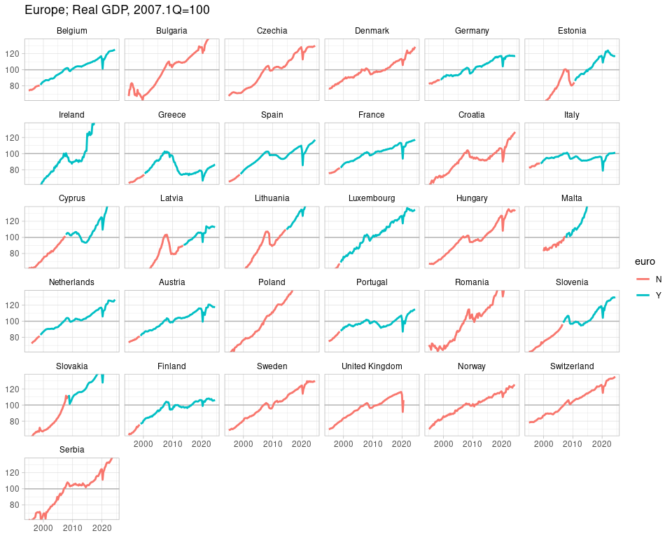

European countries’ GDP, euro or not
================
Mitsuo Shiota
2019-04-11

  - [Summary](#summary)
  - [Libraries](#libraries)
  - [Get GDP data](#get-gdp-data)
  - [Add country names by looking up
    codes](#add-country-names-by-looking-up-codes)
  - [Which country introduced euro, and
    when](#which-country-introduced-euro-and-when)
  - [Plot](#plot)
  - [Euro or not](#euro-or-not)
      - [Simple comparison of recovery from the Great
        Recession](#simple-comparison-of-recovery-from-the-great-recession)
      - [Before and after growth rates, and classifier: logistic
        regression](#before-and-after-growth-rates-and-classifier-logistic-regression)

Updated: 2021-01-08

## Summary

  - [European countries’ GDP line chart in
    pdf](output/GDP-euro-or-not.pdf)
  - [How much recovered from the Great Recession boxplot, in euro or
    not, in pdf](output/GDP-euro-or-not2.pdf)
  - [GDP growth rates plot (x: 1995-2007, y: 2007-latest) in
    pdf](output/GDP-euro-or-not3.pdf)
  - [GDP growth rates plot (x: 2000-2005, y: 2005-latest) in
    pdf](output/GDP-euro-or-not4.pdf)

This is my second attempt to utilize R language for economic analysis
after [Yellen’s US Labor Market
Dashboard](https://github.com/mitsuoxv/yellen-dashboard).

## Libraries

As usual I attach tidyverse package. As I will struggle with dates, I
attach lubridate packeage. I attach ggrepel package to add neat label
functionality to ggplot2. I also attach rvest package for web scraping
to get the euro entry date of each country. Although I don’t attach, I
use eurostat package to get GDP data, and countrycode package to convert
country codes to names.

``` r
library(tidyverse)
library(lubridate)
library(rvest)
library(ggrepel)
```

## Get GDP data

[Eurostat Database](https://ec.europa.eu/eurostat/data/database)
provides a wide variety of data. Honestly, it is hard to find the right
table and parameters. Anyway, I dig Data navigation tree down to
“Quarterly national accounts”, reach “GDP and main components (output,
expenditure and income) (namq\_10\_gdp)”, and know the table name is
“namq\_10\_gdp”. Click Data Explorer icon, and a new window with a
large table appears. Look at the upper part, and click + icon to know
the parameters, like:

  - unit: CLV15\_MNAC: Chain linked volumes (2015), million units of
    national currency
  - s\_adj: SCA: Seasonally and calendar adjusted data
  - na\_item: B1GQ; Gross domestic product at market prices

[Cheat sheet: eurostat R
package](https://cran.r-project.org/web/packages/eurostat/vignettes/cheatsheet.html)
helps me.

``` r
eu_gdp <- eurostat::get_eurostat(id = "namq_10_gdp",
                                 filters = list(
                                   unit = "CLV15_MNAC",
                                   s_adj = "SCA",
                                   na_item = "B1GQ")
                                 )

eu_gdp <- eu_gdp %>% 
  select(time, geo, values)

eu_gdp$geo <- as.character(eu_gdp$geo)
```

## Add country names by looking up codes

I follow the order of [“Tutorial: Country codes and protocol
order”](https://ec.europa.eu/eurostat/statistics-explained/index.php/Tutorial:Country_codes_and_protocol_order).

``` r
country_codes_eu28 <- c("BE", "BG", "CZ", "DK", "DE", "EE", "IE",
                   "EL", "ES", "FR", "HR", "IT", "CY", "LV",
                   "LT", "LU", "HU", "MT", "NL", "AT", "PL", 
                   "PT", "RO", "SI", "SK", "FI", "SE", "UK") 
```

GDP data contain 3 countries outside EU, so I add them to codes.

``` r
country_codes <- c(country_codes_eu28, "NO", "CH", "RS")
```

I create the lookup table of country code and name by utilizing
countrycode package.

``` r
lookup_tbl <- tibble(
  geo = country_codes,
  name = countrycode::countrycode(country_codes, 'eurostat', 'country.name')
)
```

Then I add “name” column to GDP data by matching code and name, and drop
organizations, like EU-28, which don’t match country codes.

``` r
eu_gdp <- eu_gdp %>% 
  left_join(lookup_tbl, by = "geo") %>% 
  drop_na(name)
```

## Which country introduced euro, and when

Now I would like to know when countries switched from national
currencies to euro. I use rvest package for web scraping. I have found
[wiki page “Euro”](https://en.wikipedia.org/wiki/Euro), and managed to
get when euro area countries fixed their currenicies to the euro.

``` r
wiki <- read_html("https://en.wikipedia.org/wiki/Euro")

euro_entry <- wiki %>% 
  html_nodes("table") %>% 
  .[[4]] %>% 
  html_nodes("td") %>% 
  html_text() %>% 
  str_sub(1, -2)

euro_entry_tbl <- 
  tibble(
    name = euro_entry[seq(1, 95, 5)],
    date_fixed = euro_entry[seq(1, 95, 5) + 3]
  )

euro_entry_tbl$date_fixed <- as_date(euro_entry_tbl$date_fixed, format = "%d %B %Y")

euro_entry_tbl$name <- c("Austria", "Belgium", "Netherlands", "Finland", "France",
                         "Germany", "Ireland", "Italy", "Luxembourg", "Portugal",
                         "Spain", "Greece", "Slovenia", "Cyprus", "Malta",
                         "Slovakia", "Estonia", "Latvia", "Lituania")
```

I add “date\_fixed” column to GDP data, compare it with “time” column,
and get “euro” column to show whether each time (row) is in euro (“Y”)
or not (“N”).

``` r
eu_gdp <- eu_gdp %>% 
  left_join(euro_entry_tbl, by = "name") %>% 
  mutate(euro = if_else(time >= date_fixed, "Y", "N")) %>% 
  replace_na(list(euro = "N"))

eu_gdp$name <- factor(eu_gdp$name, levels = lookup_tbl$name)

eu_gdp$euro <- factor(eu_gdp$euro)
```

## Plot

I plot real GDP from 1Q 1995 by setting 1Q 2007 (just before the Great
Recession) = 100.

I set the common y-axis range so that I can see the movements of most
countries easily. As a result, some countries went out of the plot. If
you don’t like it, set YLIM as you like.

``` r
# set the parameters to plot
START <- "1995-01-01"
STD <- "2007-01-01"
YLIM <- c(75, 125)
```

Line is colored differently depending on whether it is in euro or not.

``` r
# index STD = 100
eu_gdp <- eu_gdp %>% 
  group_by(name) %>% 
  mutate(index = values / values[which(time == STD)] * 100) %>% 
  ungroup()

# plot
eu_gdp %>% 
  filter(time >= START) %>% 
  ggplot(aes(x = time, y = index)) + 
  geom_hline(yintercept = 100, color = "white", size = 2) +
  geom_line(aes(color = euro), size = 1) +
  facet_wrap(~ name) +
  coord_cartesian(ylim = YLIM) +
  theme(
    axis.title.x = element_blank(),
    axis.title.y = element_blank()
    ) +
  labs(
    title = str_c("Europe; Real GDP, ", quarter(STD, with_year = TRUE),
                  "Q=100")
    )
```

<!-- -->

``` r
ggsave(filename = "output/GDP-euro-or-not.pdf",
       width = 10, height = 8, units = "in", dpi = 300)
```

## Euro or not

As coronavirus disrupted the economic recovery in 2020, from now on I
will analyze the recovery up to the first quarter of 2020.

``` r
END <- "2020-01-01"
```

### Simple comparison of recovery from the Great Recession

Can I say something by looking at the plot? Did the countries in euro
fail to recover as much as the countries outside of euro did?

I compare how much GDP recovered from the Great Recession between euro
and non-euro countries.

``` r
# change euro as of STD
eu_gdp2 <- eu_gdp %>% 
  mutate(euro = if_else(date_fixed <= STD, "Y", "N")) %>% 
  replace_na(list(euro = "N"))

# get the latest GDP for each country
latest_gdp <- eu_gdp2 %>% 
  drop_na(values) %>% 
  group_by(name) %>% 
  filter(time == END) %>% 
#  filter(time == max(time)) %>% 
  ungroup()

latest_gdp %>% 
  ggplot(aes(x = euro, y = index)) +
  geom_hline(yintercept = 100, color = "white", size = 2) +
  geom_boxplot() +
  labs(
    title = "How much recovered?",
    x = str_c("In euro or not as of ", quarter(STD, with_year = TRUE), "Q"),
    y = str_c("Latest Real GDP, ", quarter(STD, with_year = TRUE), "Q=100"))
```

<!-- -->

``` r
ggsave(filename = "output/GDP-euro-or-not2.pdf",
       width = 3, height = 4, units = "in", dpi = 300)
```

Who are the winners, and who are the losers?

``` r
latest_gdp$euro <- factor(latest_gdp$euro)
latest_gdp %>% 
  select(time, name, euro, index) %>% 
  arrange(desc(index))
```

    ## # A tibble: 30 x 4
    ##    time       name        euro  index
    ##    <date>     <fct>       <fct> <dbl>
    ##  1 2020-01-01 Malta       N      174.
    ##  2 2020-01-01 Ireland     Y      162.
    ##  3 2020-01-01 Poland      N      157.
    ##  4 2020-01-01 Romania     N      146.
    ##  5 2020-01-01 Bulgaria    N      134.
    ##  6 2020-01-01 Lithuania   N      130.
    ##  7 2020-01-01 Luxembourg  Y      130.
    ##  8 2020-01-01 Serbia      N      130.
    ##  9 2020-01-01 Hungary     N      125.
    ## 10 2020-01-01 Switzerland N      124.
    ## # … with 20 more rows

``` r
latest_gdp %>% 
  select(time, name, euro, index) %>% 
  arrange(index)
```

    ## # A tibble: 30 x 4
    ##    time       name           euro  index
    ##    <date>     <fct>          <fct> <dbl>
    ##  1 2020-01-01 Greece         Y      74.5
    ##  2 2020-01-01 Italy          Y      90.8
    ##  3 2020-01-01 Portugal       Y     103. 
    ##  4 2020-01-01 Spain          Y     104. 
    ##  5 2020-01-01 Croatia        N     105. 
    ##  6 2020-01-01 Finland        Y     105. 
    ##  7 2020-01-01 France         Y     106. 
    ##  8 2020-01-01 Latvia         N     107. 
    ##  9 2020-01-01 Austria        Y     112. 
    ## 10 2020-01-01 United Kingdom N     113. 
    ## # … with 20 more rows

But this comparison may be unfair. Euro area countries are so advanced
that they have already reaped low hanging fruits of productivity, and
that their demography is not favorable for growth, so their growth path
is naturally not steep. On the contrary, some European non-euro counties
are still in the developing stage, so their growth path is naturally
steep.

### Before and after growth rates, and classifier: logistic regression

So I would like to draw another plot, on x axis real GDP growth rates
from 1Q 1995 to 1Q 2007 to show the developing stage of each country,
and on y axis real GDP growth rates from 1Q 2007 to the latest to show
how much each country recovered from the Great Recession.

``` r
gdp_2index <- eu_gdp2 %>% 
  filter(time == START) %>% 
  select(time, name, index) %>% 
  left_join(latest_gdp, by = "name")

gdp_2index$time.std <- as.Date(STD)

gdp_gr <- gdp_2index %>% 
  mutate(
    start2std = time_length(difftime(time.std, time.x), "years"),
    std2latest = time_length(difftime(time.y, time.std), "years"),
    gr1 = ((100 / index.x)^(1 / start2std) - 1) * 100,
    gr2 = ((index.y / 100)^(1 / std2latest) - 1) * 100
  ) %>% 
  drop_na(gr1) %>% 
  select(name, euro, gr1, gr2)

gdp_gr
```

    ## # A tibble: 27 x 4
    ##    name        euro    gr1    gr2
    ##    <fct>       <fct> <dbl>  <dbl>
    ##  1 Austria     Y      2.56  0.881
    ##  2 Belgium     Y      2.51  0.944
    ##  3 Bulgaria    N      3.39  2.28 
    ##  4 Switzerland N      2.11  1.64 
    ##  5 Cyprus      N      4.16  1.27 
    ##  6 Germany     Y      1.54  1.03 
    ##  7 Denmark     N      2.19  1.01 
    ##  8 Estonia     N      6.99  1.24 
    ##  9 Greece      Y      3.83 -2.24 
    ## 10 Spain       Y      3.68  0.287
    ## # … with 17 more rows

``` r
gdp_2index %>% 
  anti_join(gdp_gr, by = "name") %>% 
  select(name)
```

    ## # A tibble: 3 x 1
    ##   name       
    ##   <fct>      
    ## 1 Czechia    
    ## 2 Malta      
    ## 3 Netherlands

I lose 3 countries, because their data at 1Q 1995 is not available.

If the growth rates before and after the Great Recession is the same,
that country positions on the upslope straight line. All countries are
below that line. How far apart from that line shows how much the growth
rates declined after the Great Recession.

Baltic Tigers (Estonia, Latvia, and Lithuania) declined most just after
the Lehman shock, but now steadily recovering, so time will heal them.
Except Baltic Tigers, non euro countries are near the straight line,
means the shock did not affect their growth path significantly.

On the contrary, euro countries are not near the straight line, except
Germany. Sudden stop of capital flow to some euro countries is the
asymmetric shock for them, and they continue to struggle.

I also try logistic regression to classify euro or not as of 1Q 2007 by
featuring gr1 (real GDP growth rates from 1Q 1995 to 1Q 2007) and gr2
(from 1Q 2007 to the latest). The dashed line is the border line of
classification with upper side non-euro and down side euro.

Look at “Pr(\>|z|)”. I would not say both gr1 and gr2 are statistically
insignificant based on traditional 0.05 cut p-values, following [the
Statement of the American
Statistician](https://amstat.tandfonline.com/doi/full/10.1080/00031305.2016.1154108#.XK_rM-j7TmY).
I think gr2 has some predicting power. If two economies are equally
advanced (gr1 is the same), recovery looks to be slower in the euro than
out of euro.

``` r
fit <- glm(euro ~ gr1 + gr2, data = gdp_gr, family = binomial)

summary(fit)
```

    ## 
    ## Call:
    ## glm(formula = euro ~ gr1 + gr2, family = binomial, data = gdp_gr)
    ## 
    ## Deviance Residuals: 
    ##     Min       1Q   Median       3Q      Max  
    ## -1.3106  -0.9855  -0.6129   1.0166   2.4240  
    ## 
    ## Coefficients:
    ##             Estimate Std. Error z value Pr(>|z|)
    ## (Intercept)   1.2931     1.1531   1.121    0.262
    ## gr1          -0.1707     0.2889  -0.591    0.555
    ## gr2          -0.7752     0.4795  -1.617    0.106
    ## 
    ## (Dispersion parameter for binomial family taken to be 1)
    ## 
    ##     Null deviance: 37.096  on 26  degrees of freedom
    ## Residual deviance: 32.058  on 24  degrees of freedom
    ## AIC: 38.058
    ## 
    ## Number of Fisher Scoring iterations: 4

``` r
coefs <- coefficients(fit)

gdp_gr %>% 
  ggplot(aes(x = gr1, y = gr2)) +
  geom_abline(intercept = 0, slope = 1) +
  geom_abline(intercept = - coefs[1] / coefs[3], slope = - coefs[2] / coefs[3],  linetype = "dashed") +
  geom_point(aes(color = euro)) +
  geom_text_repel(aes(label = name), size = 4) +
  labs(
    title = "Real GDP growth rates (percent, annualized)",
    x = str_c("From ", quarter(START, with_year = TRUE), "Q to ", quarter(STD, with_year = TRUE), "Q"),
    y = str_c("From ", quarter(STD, with_year = TRUE), "Q to the latest"),
    color = str_c("euro as of\n", quarter(STD, with_year = TRUE), "Q")
  )
```

<!-- -->

``` r
ggsave(filename = "output/GDP-euro-or-not3.pdf",
       width = 8, height = 8, units = "in", dpi = 300)
```

The logstic regression model classifies correctly 21 out of 25
countries. It assigns euro probability to each country. Among euro
countries, the highest probabilities go to Greece, Italy and Portugal.
They are the most euro-ic countries, according to this model. Ireland
has the lowest probability, and is misclassified as non-euro, probably
because of [Leprechaun
economics](https://en.wikipedia.org/wiki/Leprechaun_economics).

The model misclassifies 1 non-euro country, Denmark, as a euro country.
The model may excuse itself by saying that [Denmark krone is pegged to
the euro](https://en.wikipedia.org/wiki/Denmark_and_the_euro).

``` r
contrasts(gdp_gr$euro)
```

    ##   Y
    ## N 0
    ## Y 1

``` r
gdp_gr$pred_prob <- predict(fit, type = "response")

gdp_gr <- gdp_gr %>% 
  mutate(pred = if_else(pred_prob > 0.5, "Y", "N"))

gdp_gr$pred <- factor(gdp_gr$pred, levels = c("N", "Y"))

contrasts(gdp_gr$pred)
```

    ##   Y
    ## N 0
    ## Y 1

``` r
table(gdp_gr$euro, gdp_gr$pred, deparse.level = 2)
```

    ##            gdp_gr$pred
    ## gdp_gr$euro  N  Y
    ##           N 12  3
    ##           Y  3  9

``` r
mean(gdp_gr$euro == gdp_gr$pred)
```

    ## [1] 0.7777778

``` r
gdp_gr %>% 
  filter(euro == "Y") %>% 
  arrange(desc(pred_prob))
```

    ## # A tibble: 12 x 6
    ##    name       euro    gr1    gr2 pred_prob pred 
    ##    <fct>      <fct> <dbl>  <dbl>     <dbl> <fct>
    ##  1 Greece     Y      3.83 -2.24     0.915  Y    
    ##  2 Italy      Y      1.54 -0.736    0.832  Y    
    ##  3 Portugal   Y      2.44  0.202    0.672  Y    
    ##  4 France     Y      2.30  0.443    0.636  Y    
    ##  5 Spain      Y      3.68  0.287    0.609  Y    
    ##  6 Finland    Y      3.96  0.358    0.584  Y    
    ##  7 Germany    Y      1.54  1.03     0.557  Y    
    ##  8 Austria    Y      2.56  0.881    0.543  Y    
    ##  9 Belgium    Y      2.51  0.944    0.533  Y    
    ## 10 Slovenia   Y      4.12  0.934    0.466  N    
    ## 11 Luxembourg Y      4.82  2.03     0.250  N    
    ## 12 Ireland    Y      7.19  3.80     0.0530 N

You can change parameters like START and STD, and may see the growth
trend shift differently. For example, below I set START as 1Q 2000, STD
as 1Q 2005.

``` r
START <- "2000-01-01"
STD <- "2005-01-01"
```

    ## Warning: ggrepel: 1 unlabeled data points (too many overlaps). Consider
    ## increasing max.overlaps

<!-- -->

    ## Warning: ggrepel: 1 unlabeled data points (too many overlaps). Consider
    ## increasing max.overlaps

    ##            gdp_gr$pred
    ## gdp_gr$euro  N  Y
    ##           N 13  4
    ##           Y  3 10

    ## [1] 0.7666667

    ## # A tibble: 13 x 6
    ##    name        euro    gr1    gr2 pred_prob pred 
    ##    <fct>       <fct> <dbl>  <dbl>     <dbl> <fct>
    ##  1 Italy       Y      1.77 -0.638    0.893  Y    
    ##  2 Greece      Y      5.74 -1.94     0.884  Y    
    ##  3 Portugal    Y      1.65  0.175    0.814  Y    
    ##  4 France      Y      2.75  0.384    0.727  Y    
    ##  5 Germany     Y      1.81  0.893    0.698  Y    
    ##  6 Finland     Y      4.38  0.310    0.638  Y    
    ##  7 Netherlands Y      2.85  0.860    0.636  Y    
    ##  8 Austria     Y      3.19  0.764    0.632  Y    
    ##  9 Belgium     Y      3.24  0.817    0.618  Y    
    ## 10 Spain       Y      4.96  0.249    0.609  Y    
    ## 11 Slovenia    Y      6.18  0.809    0.407  N    
    ## 12 Luxembourg  Y      5.37  1.75     0.284  N    
    ## 13 Ireland     Y      8.76  3.29     0.0396 N

This time I don’t lose any country, and Germany is more euro-ic.

EOL
